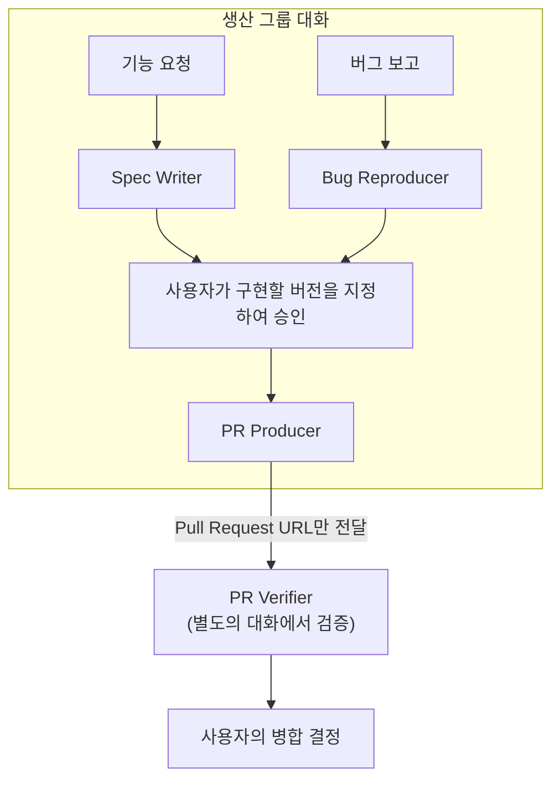

# Grok Bot Profiles

[English](README.md) | [한국어](README.ko.md)

> 하나의 결과물. 하나의 승인 경계. 하나의 봇.

바로 사용할 수 있는 Grok Bot 프로필 모음입니다. 각 프로필은 봇이 수행할 하나의 명확한 역할과 봇이 산출할 구체적인 결과물을 정의하고, 봇에게 부여된 권한이 끝나는 지점까지 명시합니다.

범용 에이전트 하나에 여러 역할을 함께 맡기면, 각 작업의 책임 범위가 불분명해집니다. 이 모음은 명세 작성, 조사, 구현, 검증을 서로 분리하여 봇이 자신의 작업을 직접 승인하지 못하게 합니다.

## 빠른 시작

Grok Bot은 로컬 파일을 직접 가져오지 않습니다. 다음 절차에 따라 프로필을 설치하세요.

1. 새로운 Grok Bot을 만듭니다.
2. 아래 표에서 사용하려는 프로필을 찾아 **설정 프롬프트** URL을 복사합니다.
3. 복사한 URL을 봇의 첫 메시지로 붙여 넣습니다.
4. 프로필에 연결해야 하는 서비스가 명시되어 있다면 그 서비스를 연결합니다.
5. 해당 프로필의 README에 있는 **첫 작업**을 봇에게 보냅니다.

`SETUP.md`는 봇이 `PROFILE.md`를 가져오게 한 다음, 봇의 Name과 Title, Description을 설정합니다. `PROFILE.md`에 작성된 내용을 Description에 직접 붙여 넣지 마세요.

### 개발

| 프로필 | 다음과 같은 작업에 사용합니다 | 설정 프롬프트 |
| --- | --- | --- |
| [Spec Writer](bots/development/spec-writer/) | 선택한 아이디어나 요청, 불명확한 이슈를 구현에 착수할 수 있는 명세로 정리합니다 | [URL](https://raw.githubusercontent.com/HAEGONG/grok-bot-profiles/main/bots/development/spec-writer/SETUP.md) |
| [Bug Reproducer](bots/development/bug-reproducer/) | 선택한 버그 보고서를 조사하여 재현 가능 여부와 근거를 정리합니다 | [URL](https://raw.githubusercontent.com/HAEGONG/grok-bot-profiles/main/bots/development/bug-reproducer/SETUP.md) |
| [PR Producer](bots/development/pr-producer/) | 승인된 작업만 구현한 브랜치와 검토 가능한 Pull Request를 만듭니다 | [URL](https://raw.githubusercontent.com/HAEGONG/grok-bot-profiles/main/bots/development/pr-producer/SETUP.md) |
| [PR Verifier](bots/development/pr-verifier/) | Pull Request를 독립적으로 검증하고 `PASS`, `BLOCK`, `HOLD` 중 하나로 판정합니다 | [URL](https://raw.githubusercontent.com/HAEGONG/grok-bot-profiles/main/bots/development/pr-verifier/SETUP.md) |

### 생산성

| 프로필 | 다음과 같은 작업에 사용합니다 | 설정 프롬프트 |
| --- | --- | --- |
| [Research Scout](bots/productivity/research-scout/) | 키워드를 조사하여 모든 주장에 출처를 붙인 조사 보고서를 작성합니다 | [URL](https://raw.githubusercontent.com/HAEGONG/grok-bot-profiles/main/bots/productivity/research-scout/SETUP.md) |

### 자신만의 봇 만들기

다른 역할을 수행하는 프로필이 필요하다면 [CREATE_YOUR_OWN_BOT.md](CREATE_YOUR_OWN_BOT.md)를 참고하세요. 이 문서에서 프로필 템플릿, AI를 활용한 생성 프롬프트, 검토 체크리스트를 확인할 수 있습니다.

Grok Bot을 처음 사용한다면 공식 [시작하기](https://docs.x.ai/grok-bot/get-started) 문서와 [봇 생성 및 관리](https://docs.x.ai/grok-bot/bots) 문서를 참고하세요.

## 개발 작업 흐름

각 역할마다 서로 다른 Grok Bot을 만들어 사용하세요. 사용자가 결과물을 직접 복사하지 않고도 내용을 확인하고 전달을 승인할 수 있도록, 결과물을 생산하는 세 봇은 하나의 그룹 대화에 함께 참여시키고 PR Verifier는 그 대화에서 제외해야 합니다. 어떤 봇이 결과물을 그룹 대화에 게시하더라도 다음 봇이 그것만으로 작업을 시작하지는 않습니다.



봇이 결과물을 다른 봇에게 전달하는 행위는 사용자의 승인을 대신하지 못합니다. PR Producer는 사용자가 직접 승인한 작업만 구현하며, 이때 승인 메시지는 결과물의 버전 라벨을 언급하거나 해당 버전이 담긴 메시지에 답장하는 방식으로 대상을 명확히 지정해야 합니다. 또한 PR Producer는 Pull Request URL을 PR Verifier에게 보내기 전에 사용자에게 승인을 요청합니다.

기능 요청 경로에서는 사용자가 Spec Writer가 작성한 명세의 버전을 승인합니다. 반면 버그 경로에서는 재현 보고서가 재현 근거만 담고 있어서 구현이 충족해야 할 조건이 정의되어 있지 않습니다. 그래서 이 경로에서는 PR Producer가 인수 조건과 영향받는 계약, 검증 명령, 비목표를 갖춘 `brief v1`을 직접 작성합니다. 이때 PR Producer는 그 인수 조건을 사용자에게서 받은 것이 아니라 스스로 도출했다는 사실을 밝힌 뒤에 사용자의 승인을 기다립니다.

| 봇 | 다음 작업에 착수하기 전에 반드시 중단해야 합니다 |
| --- | --- |
| Spec Writer | 명세를 승인하거나 명세대로 구현하는 작업 |
| Bug Reproducer | 코드를 수정하거나 코딩 에이전트를 호출하는 작업 |
| PR Producer | 사용자가 버전을 지정하여 승인하지 않은 구현 작업과, Pull Request를 검토하거나 승인하거나 병합하는 작업 |
| PR Verifier | 수정 사항을 직접 구현하거나 Pull Request를 병합하는 작업, 그리고 생산 그룹 대화 안에서 검증을 수행하는 작업 |

PR Producer와 PR Verifier에는 같은 봇이나 같은 대화를 사용하면 안 되며, 두 봇을 같은 그룹 대화에 함께 두어서도 안 됩니다. 두 역할을 분리해야 비로소 승인 경계가 성립하기 때문에, 이 분리는 구현 과정에서 편의에 따라 조정할 수 있는 세부 사항이 아닙니다. 다만 봇들은 계정마다 하나의 컴퓨터와 브라우저 세션을 공유하므로, 이 분리가 보안 경계로 기능하지는 않습니다. 이 분리가 실제로 보호하는 대상은 검증 판단의 근거입니다.

## 프로필의 작동 방식

각 봇 디렉터리에는 다음 세 파일이 있습니다.

| 파일 | 용도 |
| --- | --- |
| `PROFILE.md` | 봇에게 항상 적용되는 정체성과 역할, 결과물이 갖추어야 할 형식과 조건, 작업 규칙, 승인 경계를 정의합니다 |
| `SETUP.md` | 최초 한 번만 사용하는 설정 메시지와 해당 작업에 필요한 실행 체크리스트를 제공합니다 |
| `README.md` | 설치 방법과 연결해야 하는 서비스, 함께 사용할 관련 봇, 첫 작업을 안내합니다 |

`PROFILE.md`에 작성된 YAML 프런트매터는 Grok Bot 인터페이스에서 다음 필드에 각각 대응합니다.

| 앱 필드 | 프로필에서 가져오는 값 |
| --- | --- |
| Name | `name` |
| Title | `title` |
| Description | YAML 프런트매터 아래에 작성된 Markdown 본문 |
| Plugins | `integrations` |
| Avatar | 앱에서 직접 설정합니다 |

## 설계 원칙

- **기술 스택이 아니라 결과물을 기준으로 나눕니다.** 프런트엔드 작업과 백엔드 작업이 같은 사용자 결과물을 만든다면 하나의 봇이 두 작업을 모두 담당할 수 있습니다.
- **구현과 검증을 분리합니다.** 봇은 자신이 만든 작업을 검토하거나 승인하면 안 됩니다.
- **Description에는 지속적으로 적용할 내용만 작성합니다.** 언제나 적용해야 하는 역할 규칙은 `PROFILE.md`에 작성하고, 설정 방법이나 특정 작업에만 필요한 지침은 별도의 문서에 작성합니다.
- **실패를 명시적으로 표현합니다.** 봇이 상황을 추측하거나 권한을 임의로 확대하지 않도록 `BLOCKED`, `HOLD`처럼 이름이 있는 결과를 사용합니다.
- **직접 확인할 수 있는 근거를 요구합니다.** 봇은 로그와 테스트 결과, 검사 상태, URL, 저장소 상태를 임의로 지어내면 안 됩니다.
- **권한 경계에서 중단합니다.** Pull Request를 열고, 승인하고, 병합하고, 배포하는 작업은 서로 다른 권한입니다.
- **전달과 승인을 구분합니다.** 현재 대화에 결과물을 남기거나 부족한 입력을 안내하는 일에는 별도의 승인이 필요하지 않습니다. 그러나 다른 봇에게 다음 작업을 요청하는 일에는 사용자의 승인이 필요합니다. 그룹 대화에서는 특정 봇을 지목하지 않은 요청에도 참여 봇이 스스로 응답할 수 있기 때문에, 그런 요청 역시 승인을 받아야 합니다.
- **요청받은 작업만 시작합니다.** 봇은 사용자가 직접 요청했을 때, 또는 자신을 지목한 명시적인 전달을 받았을 때만 작업을 시작합니다. 그룹 대화에 남겨진 통지나 다른 봇이 반환한 결과물은 작업 지시가 아닙니다. 다만 전달 행위는 전달받은 봇의 프로필이 요구하는 사람 승인 조건까지 충족시키지는 못합니다. 그래서 PR Producer는 구현에 착수하기 전에 사용자의 승인을 다시 받아야 하지만, PR Verifier처럼 별도의 사람 승인 조건이 없는 읽기 전용 역할은 승인된 전달을 받은 즉시 검증을 시작할 수 있습니다.

결과물과 정보 출처, 사용하는 도구, 실행 일정, 승인 경계 중에서 하나라도 달라진다면 별도의 봇을 새로 만들어야 합니다.

## 저장소 구조

```text
bots/
  development/
    bug-reproducer/
    pr-producer/
    pr-verifier/
    spec-writer/
  productivity/
    research-scout/
templates/
  bot/
```

## 기여하기

새로운 프로필을 추가하거나 기존 프로필을 개선하는 Pull Request를 환영합니다. 프로필은 설치한 직후부터 사용할 수 있어야 하고, 사용자가 봇의 동작을 예측할 수 있을 만큼 역할 범위가 좁아야 하며, 봇에게 부여된 권한이 어디에서 끝나는지 명확하게 밝혀야 합니다.

이 저장소에 어떤 프로필을 추가할 수 있는지, 프로필을 추가하는 절차는 어떻게 되는지, 검토자가 무엇을 확인하는지는 [CONTRIBUTING.md](CONTRIBUTING.md)에 정리되어 있습니다.

이 프로필을 사용하여 봇을 설정하는 시간을 줄였다면 저장소에 스타를 남겨 주시고, 직접 사용해 보고 유용했던 작업 흐름을 다른 사용자와 공유해 주세요.

## 라이선스

별도로 명시하지 않은 한, 이 저장소의 자료는 [Creative Commons Attribution 4.0 International License](LICENSE)에 따라 이용할 수 있습니다. 자료를 공유하거나 수정할 때는 HAEGONG을 저작자로 표시하고, 이 저장소와 라이선스로 연결되는 링크를 제공하며, 변경 여부를 밝혀야 합니다.
