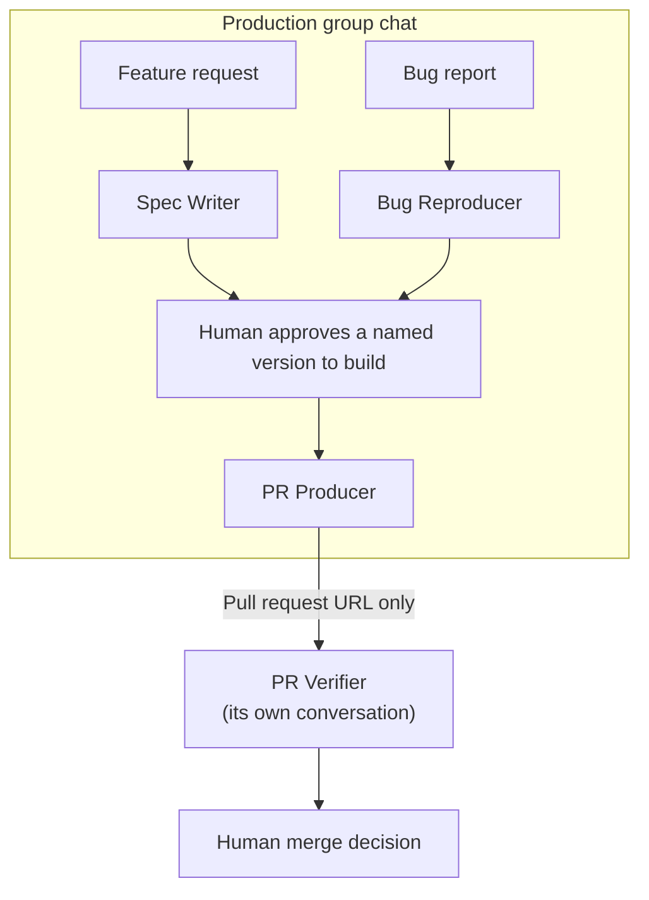

# Grok Bot Profiles

[English](README.md) | [한국어](README.ko.md)

> One outcome. One approval boundary. One bot.

Ready-to-use profiles for Grok Bots. Each profile gives a bot one focused job, a concrete deliverable, and an explicit point where its authority ends.

General-purpose agents blur responsibility. This collection keeps specification, investigation, implementation, and verification separate so a bot never approves its own work.

## Quick start

Grok Bot does not import local files. To install a profile:

1. Create a new Grok Bot.
2. Copy the profile's **Setup prompt** URL from the table below.
3. Paste the URL as the bot's first message.
4. Connect GitHub when the bot asks for it.
5. Send the **First task** from the profile's README.

`SETUP.md` fetches the profile and configures the bot's Name, Title, and Description. Do not paste `PROFILE.md` into Description by hand.

| Profile | Use it when you need to | Setup prompt |
| --- | --- | --- |
| [Spec Writer](bots/development/spec-writer/) | Turn a selected idea, request, or unclear issue into an implementation-ready specification | [Copy raw URL](https://raw.githubusercontent.com/HAEGONG/grok-bot-profiles/main/bots/development/spec-writer/SETUP.md) |
| [Bug Reproducer](bots/development/bug-reproducer/) | Turn a selected bug report into a reproducibility verdict and evidence report | [Copy raw URL](https://raw.githubusercontent.com/HAEGONG/grok-bot-profiles/main/bots/development/bug-reproducer/SETUP.md) |
| [PR Producer](bots/development/pr-producer/) | Turn approved work into a focused branch and reviewable pull request | [Copy raw URL](https://raw.githubusercontent.com/HAEGONG/grok-bot-profiles/main/bots/development/pr-producer/SETUP.md) |
| [PR Verifier](bots/development/pr-verifier/) | Independently evaluate a pull request and return `PASS`, `BLOCK`, or `HOLD` | [Copy raw URL](https://raw.githubusercontent.com/HAEGONG/grok-bot-profiles/main/bots/development/pr-verifier/SETUP.md) |

### Create your own bot

Want a profile for a different job? See [CREATE_YOUR_OWN_BOT.md](CREATE_YOUR_OWN_BOT.md) for the profile template, AI-assisted creation prompt, and review checklist.

New to Grok Bots? See the official [Get started](https://docs.x.ai/grok-bot/get-started) and [Create and manage Bots](https://docs.x.ai/grok-bot/bots) guides.

## Development workflow

Use each role as a separate Grok Bot. Put the production roles in one group chat so drafts stay visible and you can approve a named handover without copying its content, and keep PR Verifier outside it. A draft appearing in the group does not start the next bot:



Handing a draft to another bot is not approval. PR Producer implements only what you approve yourself, identified by version label or by replying to the message that holds that version, and it asks before sending the URL to PR Verifier.

On the feature path you approve a Spec Writer specification version. On the bug path a reproduction report carries evidence but no contract, so PR Producer writes its own `brief v1` with acceptance criteria, contracts, verification, and non-goals, says the criteria are its own, and waits for you to approve that brief.

| Bot | Must stop before |
| --- | --- |
| Spec Writer | Approving the specification or implementing it |
| Bug Reproducer | Editing code or invoking a coding agent |
| PR Producer | Implementing without your version-named approval, and reviewing, approving, or merging the pull request |
| PR Verifier | Implementing fixes, merging, or verifying inside a production group chat |

The PR Producer and PR Verifier must never be the same bot, share a conversation, or sit in the same group chat. Their separation is the approval boundary, not an implementation detail. Bots share one computer and browser session per account, so this separation protects the basis for the verdict rather than acting as a security boundary.

## How profiles work

Every bot directory contains three files:

| File | Purpose |
| --- | --- |
| `PROFILE.md` | Durable identity, job, output contract, working rules, and approval boundary |
| `SETUP.md` | One-time setup message and task-specific operating checklist |
| `README.md` | Installation instructions, required integrations, related bots, and first task |

The YAML frontmatter in `PROFILE.md` maps to the Grok Bot interface:

| App field | Profile source |
| --- | --- |
| Name | `name` |
| Title | `title` |
| Description | Markdown body below the frontmatter |
| Plugins | `integrations` |
| Avatar | Configure directly in the app |

## Design principles

- **Split by outcome, not stack.** Frontend and backend work can belong to one bot when they serve the same user outcome.
- **Separate production from verification.** A bot must not review or approve work it produced.
- **Keep Description durable.** Put permanent role rules in `PROFILE.md`; put setup and task-specific instructions elsewhere.
- **Make failure explicit.** Use named outcomes such as `BLOCKED` or `HOLD` instead of guessing or silently expanding authority.
- **Require observable evidence.** Never invent logs, test results, check status, URLs, or repository state.
- **Stop at the boundary.** Opening, approving, merging, and deploying a pull request are different permissions.
- **Separate handover from approval.** Returning a result or a notice of missing input in the current conversation needs no approval, but asking another bot to take the next action does, even when the message names no bot in a group where bots may choose to respond. A bot also starts work only on your direct request or an explicit handover addressed to it, so a notice left in a group does not wake it. A handover never satisfies a human-approval condition written into the receiving bot's own profile, so PR Producer still needs your approval to implement, while a read-only role such as PR Verifier can act on an approved handover directly.

Create a separate bot when the outcome, information sources, tools, schedule, or approval boundary changes.

## Repository layout

```text
bots/
  development/
    bug-reproducer/
    pr-producer/
    pr-verifier/
    spec-writer/
templates/
  bot/
```

## Contributing

Pull requests for new profiles and improvements to existing ones are welcome. Profiles should be immediately useful, narrow enough to trust, and explicit about authority.

See [CONTRIBUTING.md](CONTRIBUTING.md) for what belongs here, how to add a profile, and what reviewers check.

If these profiles save you a setup cycle, star the repository and share the workflow that worked for you.

## License

Except where otherwise noted, this repository is licensed under the [Creative Commons Attribution 4.0 International License](LICENSE). When sharing or adapting this work, credit HAEGONG, link to this repository and the license, and indicate whether you made changes.
